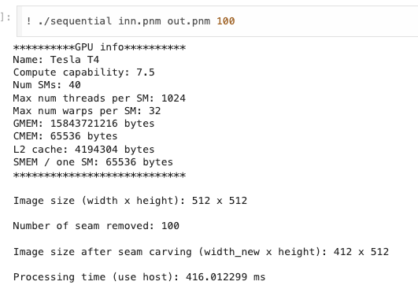
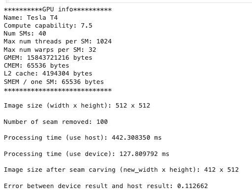
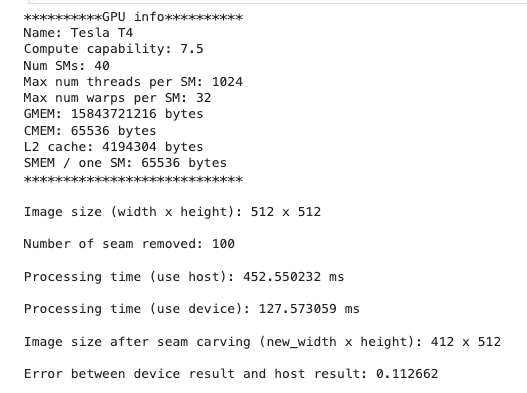
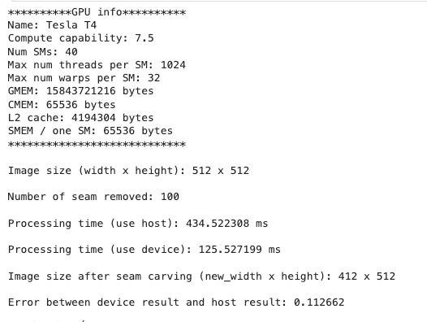
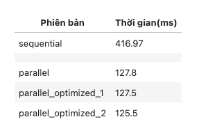

# 
 Seam Carving algorithm 

## 1. Description

- The image is often displayed at different resolutions on different devices, causing difficulty in viewing the image. Changing the aspect ratio or cropping the image is not a good idea in this case as it can result in loss of image information when done automatically. Therefore, Seam carving was born to automatically handle these cases in the most efficient way
- Seam carving is an algorithm used to resize images in a more natural and efficient way compared to previous algorithms by removing less important pixels along the seam and preserving important pixels when shrinking the image.
- Deleting less important pixels at random positions would distort the image, making it unnatural compared to the original. To address this issue when shrinking images horizontally, the Seam Carving algorithm deletes columns along the seam, which is a path from top to bottom connected by pixels, and these pixels are neighbors of each other. When reducing the height of the image, it will find and delete seams horizontally.

**Input:** The image to be resized, RGB color image, and the number of seams to be removed.

**Output:** The RGB image resized horizontally.

**Speed:** Speed improvement is needed to process images in real-time

## 2. How is this implemented?

- **Algorithm:**

  - **Step 1:** Convert the RGB color image to grayscale.
  - **Step 2:** Calculate the energy (importance) score of pixels by taking the absolute sum of the convolution of the grayscale image with xSobel and ySobel kernels.
  - **Step 3:** From the energy scores, compute the seam value table to find the seam with the smallest value (which is the smallest value in the last row of the table).
  - **Step 4:** From the point with the smallest value, backtrack to find the pixels that form that seam (going from bottom to top), then remove that seam by shifting all adjacent pixels to the left by 1 pixel.
  - **Step 5:** Repeat steps 2 to 4 until the desired number of seams to be removed is reached

- **The function in this project**:
  - `RGB2Gray`: Used to convert the image from RGB color to grayscale.
  - `pixelsImportant`: Used to calculate the importance of each pixel by taking the absolute sum of the convolution of the grayscale image with 2 filters, xSobel and ySobel.
  - `seamsScore`: Used to calculate the accumulated score of the smallest path based on the importance table. Starting from the second row, the score of the current seam is the minimum value of its own sum (i;j) with the sums of 3 pixels directly above it (i-1; j-1), (i-1; j), and (i-1; j+1). Since we calculate from top to bottom, the value in the last row is the final result of all seams. The second smallest value in the last row is the smallest seam value (least important) to be found.
  - `seamCarvingByHost`:
    - Convert the RGB image to grayscale and store it in `grayPixels`.
    - Calculate the energy of each pixel (importance) using the `pixelsImportant` function.
    - Create a loop with the number of iterations equal to the number of seams to be removed. In each iteration, another loop runs from the last row to the first row of the array. This inner loop is responsible for removing the pixel with the smallest seam by shifting all pixels to the left by 1 unit, then updating the values and backtracking to the column index of the neighboring pixel that forms that seam in the row above. Repeat this process until a pixel is removed from the top row, completing the removal of one seam.
    - The variable outputs hold the final result. Free up allocated memory and print out the processing time

## 3. Evaluation

Here, with the version installed on the Host, we will pass in a path to the image, the name of the output image, and the number of seams to be removed horizontally (the number of seams to find and remove).

As seen in the result above, after applying seam carving to the image, the image resolution has changed. Due to passing in 100 seam removal iterations, the length of the image has been reduced by 100 pixels. Despite reducing the length by up to 100 pixels, the image still retains its important objects.

## 4. Implementation in parallel

### Analytics

- **Convert RGB image to grayscale**: Each pixel in the RGB image can be independently converted to a grayscale image.
- **Calculate pixel energy (importance)**: Pixels' importance can be computed simultaneously by applying the energy calculation algorithm in parallel on each pixel.
- **Compute seam scores from pixel importance**: Seam energy scores can be simultaneously computed based on the importance of each pixel, allowing for parallel computation across multiple seams.
- **Remove the least important seam**: Seam removal can be performed in parallel on different seams, with each seam being processed independently of others.

### Evaluation

In this step, there's no need to display the image as it's only necessary to measure the error between the kernel function and the function on the host, which is easier to observe. Here, the error between the two functions is not significantly different, so this parallel implementation is correct. It significantly improves the time compared to running sequentially (four times faster).

## 5. Optimize the implementation in parallel

### Optimization version 1

- Convert the input image from `GMEM` to `SMEM` to reduce access time when performing convolution. Using `SMEM` is effective when threads within the same block can quickly utilize these results. - The block will read pixel value data once from `GMEM` to `SMEM`, then threads within the same block will perform computations on `SMEM`. The final result will be written from `SMEM` back to `GMEM`. Implement shared memory in this kernel function pixelsImportantKernel.

### Optimization version 2

- Similar to the first optimized version, but using `CMEM` to store the values of the `xSobel` and ySobel filters and directly reading the data of the two filters from `CMEM`.
- Modify the `pixelsImportantKernel` kernel function to read filter data from constant memory.

## 6. Final result

## 7. References

https://github.com/kalpeshdusane/Seam-Carving-B.E.-Project

https://andrewdcampbell.github.io/seam-carving

https://www.cs.cmu.edu/afs/andrew/scs/cs/15-463/f07/proj2/www/wwedler/
